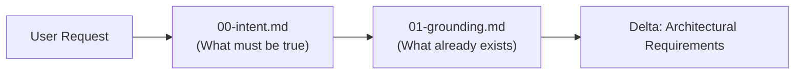
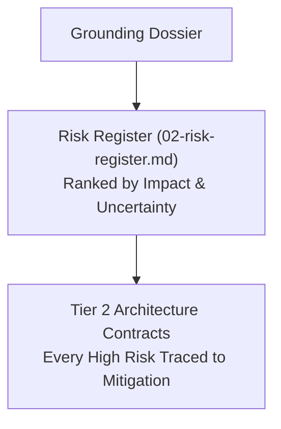
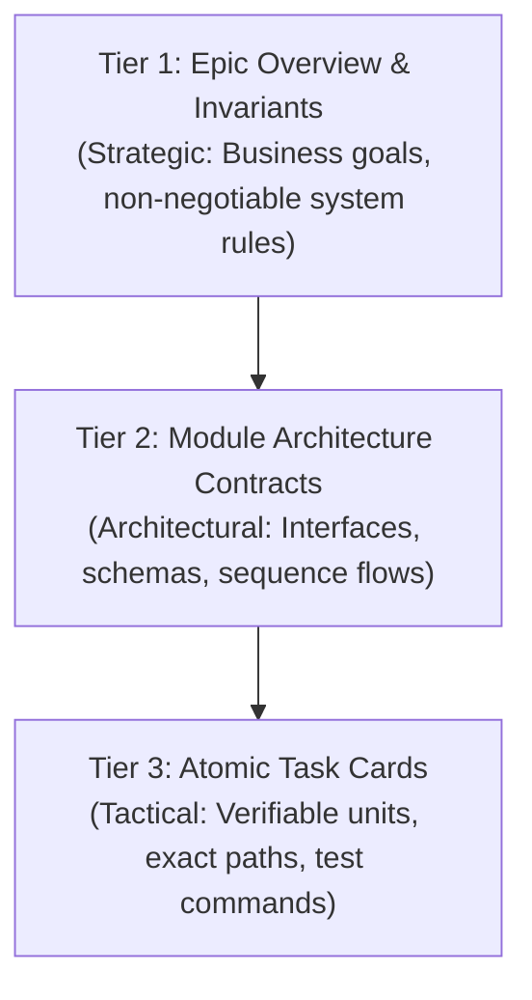
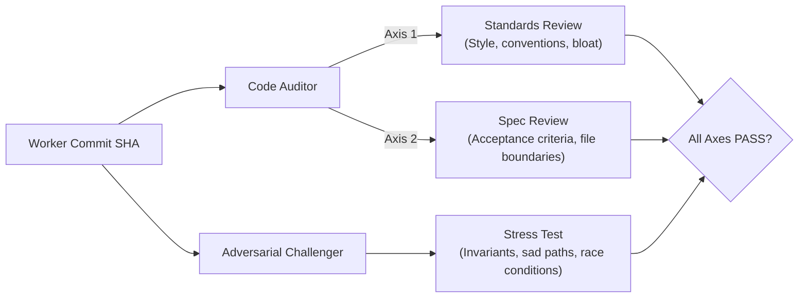
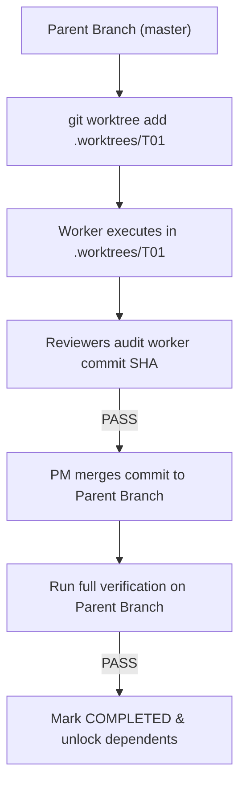

# Deep Plan: Architectural Principles and Design Rationale

This document explains the foundational theory, architectural design decisions, and engineering tradeoffs behind Deep Plan.

**Related docs:** [Tutorial](tutorial-deep-plan.md) | [How-To Guide](howto-deep-plan.md) | [Reference](reference-deep-plan.md)

---

## The Core Problem: Why AI Agents Fail at Complex Engineering

Large Language Models possess extensive knowledge of software frameworks, syntax, and design patterns. However, when tasked with non-trivial software engineering—features spanning multiple files, persistent state mutations, asynchronous boundaries, or security constraints—naive AI agents consistently fail due to well-documented cognitive failure modes:

1. **Optimistic Happy-Path Bias:** Agents default to implementing the simplest path that succeeds under ideal conditions. They routinely neglect network partitions, concurrency races, database rollback failures, and invalid input vectors unless forced to confront them.
2. **Context Window Degradation:** In long chat sessions, early requirements, user constraints, and subtle invariants are gradually pushed out of active context or diluted during context compaction. The agent drifts into building what it remembers rather than what was agreed upon.
3. **Premature Implementation:** Agents exhibit a bias toward immediate code generation. Faced with an ambiguous goal, an agent will often generate hundreds of lines of speculative code before verifying whether the codebase architecture, existing conventions, or third-party dependencies actually support the approach.
4. **Self-Confirmation and Rubber-Stamping:** When an agent reviews its own plan or code in the same context, it almost invariably approves it. The model treats its previous reasoning as authoritative context, reinforcing its own blind spots.
5. **Multi-File Contamination:** When multiple tasks are implemented in a shared working directory without strict boundaries, half-finished edits contaminate the workspace, making automated testing and isolated rollback impossible.

Deep Plan is an architectural framework designed to counteract each of these failure modes through formal separation of concerns, externalized state, and multi-axis verification gates.

---

## 1. Why Intent is Separated from Grounding

In naive workflows, an agent receives a prompt and immediately begins searching the codebase to find where to add the code. Deep Plan strictly bifurcates this into **Phase 1 (Intent)** and **Phase 2 (Grounding)**.

### The Rationale
- **User intent is problem-oriented; codebase reality is implementation-oriented.** Users frequently describe symptoms ("add a retry button") rather than root causes ("the worker times out on large payloads"). Capturing intent in `00-intent.md` locks down the underlying business objective and candidate invariants before the agent is influenced by existing codebase structures.
- **Preventing Solution-First Anchoring:** If an agent inspects the code before clearly articulating the problem, it anchors on the existing architecture—even if that architecture is flawed or inadequate for the new feature.
- **Uncovering Latent Decisions Early:** By separating intent capture from codebase exploration, the agent can immediately identify high-level forks (e.g. data ownership, persistence models) and ask the user targeted questions before wasting time mapping irrelevant subsystems.

---

## 2. Why Risks are Separated from Architecture

In conventional software development, risk analysis is frequently conducted as a post-hoc audit: an architect designs a system, and a security or operations engineer points out where it might break.

Deep Plan reverses this sequence. **The Risk Register (`02-risk-register.md`) must be authored in Phase 2, prior to Tier 2 architecture design in Phase 3.**

### The Rationale
- **Risks are Architectural Constraints:** If an API faces a potential race condition or token replay attack, that is not a detail for the implementer to figure out in a pull request. It is a fundamental constraint that dictates data schemas, transaction boundaries, and interface contracts.
- **Defeating Optimistic Bias:** Forcing the agent to document failure modes, abuse vectors, and external unknowns *before* drawing architecture diagrams ensures that resilience patterns (sliding-window fallbacks, idempotency keys, circuit breakers) are first-class architectural components rather than brittle patches added after production outages.

---

## 3. Why Three Tiers of Planning

Deep Plan rejects flat task lists (e.g. standard todo lists or unstructured markdown checklists) in favor of a three-tier hierarchy:

### The Rationale
- **Cognitive Scope Isolation:** A worker implementer working on a single function does not need—and should not have—the full cognitive overhead of the entire epic. The worker needs only the Tier 3 task card and its immediate parent Tier 2 contract. This keeps worker context windows lean and prevents hallucinations.
- **Invariant Traceability:** System invariants (e.g. `INV-1: Unsalted passwords are never written to disk`) are declared once in Tier 1. Tier 2 modules specify the enforcement mechanisms, and Tier 3 tasks link directly to the invariants they protect. If a worker diff threatens `INV-1`, the Adversarial Challenger immediately catches it.
- **Contract-Ready Atomicity:** Tasks in Tier 3 are defined not by file lines, but by **independently verifiable behavioral changes**. Downstream tasks can rely on the contracts established by upstream tasks because each tier guarantees interface stability.

---

## 4. Why Plan Review is Separated from Code Review

A universal law of systems engineering is that the cost of fixing an error grows exponentially the later it is detected:

| Phase Detected | Cost to Remediate | Deep Plan Defense |
| :--- | :--- | :--- |
| **Phase 4: Plan Review** | Low (Edit Markdown plan) | **Plan Challenger** Subagent |
| **Phase 5 / Execution** | High (Rewrite code, re-run tests) | **Code Auditor** Subagent |
| **Post-Merge / Production** | Severe (Rollback, data fix, outage) | **Integrated-Tree Gate** |

### The Rationale
- **Challenging Assumptions Before Writing Code:** The **Plan Challenger** reviews the plan before any worker is dispatched. It checks for circular dependencies, unmitigated risks, ungrounded external library assumptions, and unverifiable exit criteria. Catching a circular dependency in `dependency-dag.json` takes 30 seconds; untangling it after three workers have written conflicting branches can take hours.
- **Independent Adversarial Mandate:** The Plan Challenger operates with an explicit adversarial prompt. Its job is not to help the plan succeed, but to find reasons why it will fail. This breaks the self-confirmation bias of the planning agent.

---

## 5. Why Dual-Axis Code Auditing and Adversarial Challenging

When a worker submits a commit, Deep Plan subjects it to two distinct review subagents running in parallel:

### The Rationale
- **Separating Hygiene from Specification:** Human and AI reviewers often suffer from "linter distraction"—spending energy commenting on variable names and formatting while completely missing that a critical acceptance criterion was omitted. The **Code Auditor** explicitly evaluates the diff along two separate axes:
  - **Standards Axis:** Does the code follow repository hygiene and maintainability conventions?
  - **Spec Axis:** Did the worker satisfy the exact Tier 3 contract without adding unauthorized changes or scope creep?
- **The Adversarial Mindset:** Unit tests written by the worker demonstrate that the code works under expected inputs. The **Adversarial Challenger** asks the opposite question: *What breaks under malformed inputs, timeouts, network latency, and concurrency?* It validates that failure defenses specified in Tier 3 are actively enforced, not bypassed.

---

## 6. Why Worker Commits are Isolated and Explicitly Integrated

In naive multi-agent workflows, multiple subagents edit files simultaneously in the main workspace. This causes catastrophic race conditions: subagents overwrite each other's edits, dirty working trees confuse test runners, and isolating which subagent introduced a bug is impossible.

Deep Plan enforces a strict worktree isolation and integration model:

### The Rationale
- **Physical Boundary Isolation:** By executing each worker in an isolated git worktree (`git worktree add`), workers have an independent filesystem and index. Edits cannot leak across tasks.
- **The "Green on Branch, Broken on Main" Fallacy:** A worker's unit tests passing in its isolated worktree proves only that the task works in isolation. When merged with earlier tasks on the parent branch, subtle integration issues (e.g. conflicting schema migrations or middleware ordering bugs) can arise.
- **The Integration Gate:** Deep Plan requires the PM to merge the approved commit into the parent branch and re-run verification on the integrated parent tree. Dependents in the DAG are unlocked **only** after integrated verification passes.

---

## 7. Why Declared Verification Modes Replace Universal TDD

Many software methodologies prescribe Test-Driven Development (TDD) as a mandatory, universal practice. While TDD is outstanding for pure business logic and algorithmic modules, dogmatically forcing red-green TDD onto all engineering tasks creates severe friction:

- Writing a unit test that fails before running a database migration often tests mock libraries rather than the real database engine.
- Configuration changes (e.g. CI/CD pipelines, TypeScript configurations) are validated through schema compilation and static linters, not unit tests.
- Documentation updates require link checkers and rendering validation, not assertion suites.
- Performance refactors require reproducible statistical benchmarks comparing baselines to post-change throughput.

Deep Plan replaces universal TDD with **Declared Verification Modes**:
- `behavioral-tdd`
- `migration`
- `static-config`
- `documentation`
- `benchmark`
- `repository-specific`

### The Rationale
By matching the verification mode to the technical nature of the task, Deep Plan enforces maximum proof rigor without forcing agents to write vacuous or tautological tests.

---

## 8. Why Audience-Adaptive Visible Detail vs. Invariant Internal Rigor

A common tension in AI developer tooling is balancing communication for different user personas:
- Casual or product-focused users prefer concise summaries and high-level progress.
- Senior engineers and technical architects require low-level diffs, sequence diagrams, and precise failure models.

Some systems resolve this by dumbing down the planning process for casual users. **Deep Plan strictly rejects this.**

### The Rationale
- **Rigor is Non-Negotiable:** Whether a user asks "build me an auth system" or specifies an RFC 6749 OAuth2 server, the security invariants, database migrations, and failure modes remain equally dangerous. Deep Plan maintains 100% identical planning rigor, risk registers, and verification gates for every user.
- **Adaptive Presentation:** The PM orchestrator infers the user's communication depth from their prompt. It adapts only the visible explanation depth and terminology in the chat. The exhaustive technical details, contracts, and evidence trails remain fully persisted in `.deep-plan/` for auditing.

---

## 9. The Ledger as Single Source of Truth and Resume Machine

AI coding agents are inherently stateless across session restarts and subject to abrupt context compaction when token limits are reached. If an agent tracks progress purely in working memory, a session crash results in total amnesia: completed tasks are re-run, unmerged branches are orphaned, and invariants are forgotten.

Deep Plan solves this by treating `.deep-plan/<epic-slug>/progress-ledger.md` and `dependency-dag.json` as the externalized state machine.

### The Rationale
- **Deterministic Resumption:** The ledger records the exact state of every task (`READY_TO_DISPATCH`, `IN_PROGRESS`, `IN_REVIEW`, `INTEGRATING`, `COMPLETED`), the worker worktrees, the commit hashes, and the resume checkpoint.
- **Zero-Loss Recovery:** When a session is interrupted, the agent reads the ledger, confirms the parent branch git status, and immediately resumes the next ready task. Completed tasks are never re-run.

---

## 10. Tradeoffs and When NOT to Use Deep Plan

Deep Plan is optimized for correctness, resilience, and multi-file cohesion. These guarantees come with intentional overhead:

- **Coordination Cost:** Generating three tiers of plans, authoring risk registers, and running multi-axis reviews requires multiple model calls and file operations.
- **Latency:** An epic planned and executed via Deep Plan takes longer to start writing code than an agent that immediately starts modifying files.

### When NOT to Use Deep Plan
Deep Plan should not be used for:
- Single-file edits or localized bug fixes with obvious root causes.
- Purely cosmetic styling or layout adjustments.
- Routine text edits or standalone documentation updates.

For these tasks, Deep Plan's **Phase 1 entry preflight** recognizes the simplicity of the scope and offers a direct implementation choice, ensuring that developer velocity is never sacrificed for unnecessary process.
