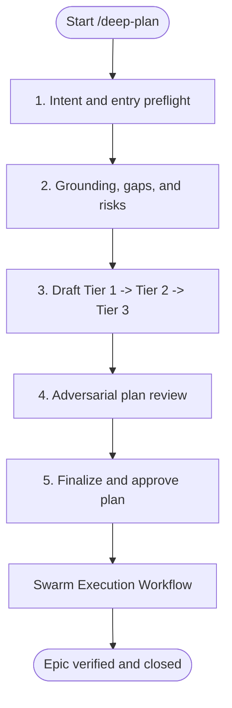

# Deep Plan Technical Reference

This document provides the authoritative technical reference for the Deep Plan skill: schemas, state machines, agent roles, invocation contracts, and verification gates.

**Related docs:** [Tutorial](tutorial-deep-plan.md) | [How-To Guide](howto-deep-plan.md) | [Explanation](explanation-deep-plan.md)

---

## 1. Core Operating Principles

1. **The Iron Law:** Never begin implementation without explicit user approval after Phase 5 (in Collaborative Mode) or validated plan completion (in Autonomous Mode).
2. **PM / Orchestrator Context Separation:** The primary agent thread serves exclusively as PM / Orchestrator—owning the DAG, ledger, plan artifacts, user communication, and branch integration. Production code is **never** implemented in the PM context.
3. **Externalized Evidence Trail:** Working memory is ephemeral; all decisions, grounding facts, risks, contracts, review findings, and execution states are persisted under `.deep-plan/<epic-slug>/`.
4. **Integration Gate:** A task is not complete when a worker's tests pass or reviewers approve a commit. A task is complete only when the commit is integrated into the parent branch, verified on the integrated tree, and recorded in the ledger.
5. **Multi-Axis Verification:** All code changes require independent review across Code Auditor Standards, Code Auditor Spec, and Adversarial Challenger axes before integration.

---

## 2. Artifact Layout and Hierarchy

All planning and execution artifacts reside in a dedicated directory per epic:

```text
.deep-plan/<epic-slug>/
├── 00-intent.md                  # Phase 1: Problem statement, goals, invariants, autonomy mode
├── 01-grounding.md               # Phase 2: Codebase stack, file map, blast radius, test harnesses
├── 02-risk-register.md           # Phase 2: Technical risks, impact/uncertainty, mitigations
├── 03-tier1-epic.md              # Phase 3: Scope boundaries, invariants, NFRs, module map
├── modules/                      # Phase 3: Tier 2 architectural module contracts
│   ├── M01-[module-name].md
│   └── M02-[module-name].md
├── tasks/                        # Phase 3: Tier 3 atomic task cards
│   ├── T01-[task-name].md
│   └── T02-[task-name].md
├── dependency-dag.json           # Phase 3: Machine-readable acyclic task dependency graph
└── progress-ledger.md            # Phase 3-5: Execution state machine and evidence journal
```

### Artifact Roles

| Artifact | Authoring Role | Phase | Purpose |
| :--- | :--- | :--- | :--- |
| `00-intent.md` | PM / Orchestrator | Phase 1 | Captures user requirements, candidate invariants, autonomy mode, and boundary decisions. |
| `01-grounding.md` | Codebase Explorer / PM | Phase 2 | Records verified repository facts, file maps, conventions, and coverage gaps. |
| `02-risk-register.md` | PM / Orchestrator | Phase 2 | Enumerates failure modes and risks with impact/uncertainty rankings before architecture design. |
| `03-tier1-epic.md` | PM / Orchestrator | Phase 3 | System invariants, non-functional requirements, and overall scope boundaries. |
| `modules/M{n}-*.md` | System / Security Architect | Phase 3 | Module interface contracts, schemas, interaction diagrams, and child task lists. |
| `tasks/T{n}-*.md` | Task Decomposer | Phase 3 | Atomic task directives, file targets, failure defenses, and verification commands. |
| `dependency-dag.json` | Task Decomposer | Phase 3 | Machine-readable dependency graph defining prerequisite execution ordering. |
| `progress-ledger.md` | PM / Orchestrator | Phase 3–5 | Single source of truth for task states, review verdicts, commit hashes, and resume checkpoints. |

---

## 3. The Five Planning Phases



### Phase 1: Intent and Entry Preflight
- **Inputs:** User prompt, repository working tree state.
- **Operations:**
  - Run git preflight (`git status --porcelain`, `git log -1`).
  - Infer communication depth from user prompt (casual vs. technical); maintain identical underlying rigor regardless of tone.
  - Determine autonomy mode: `Collaborative` (default) or `Autonomous`.
  - Persist `00-intent.md`.
  - If initial exploration indicates the task is trivial (single-file, low risk), offer a direct implementation bypass.

### Phase 2: Grounding, Gaps, and Risks
- **Inputs:** `00-intent.md`, repository code and tools.
- **Operations:**
  - Dispatch Codebase Explorer with a file-and-line evidence mandate.
  - Persist `01-grounding.md` with stack, blast radius, dependencies, and test commands.
  - Construct `02-risk-register.md` ranking risks by impact and uncertainty.
  - Resolve external library unknowns or schedule DAG research spikes.

### Phase 3: Tiered Planning
- **Inputs:** `00-intent.md`, `01-grounding.md`, `02-risk-register.md`.
- **Operations:**
  - Author Tier 1 epic scope and invariants (`03-tier1-epic.md`).
  - Author Tier 2 architecture contracts (`modules/M{n}-*.md`) via System/Security Architect.
  - Author Tier 3 atomic task cards (`tasks/T{n}-*.md`) via Task Decomposer.
  - Generate `dependency-dag.json` and initialize `progress-ledger.md`.

### Phase 4: Adversarial Plan Review
- **Inputs:** Full planning artifact bundle (`00` through `tasks/`, `dependency-dag.json`).
- **Operations:**
  - Dispatch Plan Challenger under invocation contract `plan-challenge`.
  - Stress-test against 9 challenge criteria: scope drift, inferred invariants, architectural boundaries, unmitigated risks, circular dependencies, task atomicity, verification command feasibility, external library assumptions, and security/rollback gaps.
  - Evaluate verdict (`PASS`, `REVISE`, or `USER_DECISION_REQUIRED`).
  - Pause for user synchronization if a boundary-changing fork is detected.

### Phase 5: Finalize and Approve the Plan
- **Inputs:** Approved planning artifacts, validated DAG.
- **Operations:**
  - Validate DAG acyclicity, task ID referential integrity, and ledger synchronization.
  - In Collaborative Mode: Request explicit user confirmation before initiating execution.
  - In Autonomous Mode: Proceed automatically once validation passes, unless a boundary fork was flagged.

---

## 4. Agent Roles & Specialist Catalog

| Role | Responsibility | Activation Condition | Specification Reference |
| :--- | :--- | :--- | :--- |
| **PM / Orchestrator** | Owns planning, DAG, ledger, review gates, integration, user communication | Always (Main thread) | [SKILL.md](../skills/deep-plan/SKILL.md) |
| **Codebase Explorer** | Maps AST, schemas, dependencies, blast radius, conventions | Phase 2 Grounding | [codebase-explorer.md](../skills/deep-plan/references/subagents/codebase-explorer.md) |
| **System Architect** | Designs Tier 2 boundaries, interface contracts, schemas, flows | Phase 3 Planning | [system-architect.md](../skills/deep-plan/references/subagents/system-architect.md) |
| **Security Architect** | Designs auth flows, trust boundaries, threat models, permission schemas | Phase 3 (Auth, PII, trust boundaries) | [security-architect.md](../skills/deep-plan/references/subagents/security-architect.md) |
| **Task Decomposer** | Slices modules into atomic Tier 3 tasks; creates `dependency-dag.json` | Phase 3 Planning | [task-decomposer.md](../skills/deep-plan/references/subagents/task-decomposer.md) |
| **Plan Challenger** | Adversarially reviews complete plan before execution | Phase 4 Plan Review | [plan-challenger.md](../skills/deep-plan/references/subagents/plan-challenger.md) |
| **Worker Implementer** | Implements a single ready task in an isolated worktree | Execution per ready task | [worker-implementer.md](../skills/deep-plan/references/subagents/worker-implementer.md) |
| **Performance Engineer** | Implements caching, query optimization, concurrency primitives | Execution (`perf` tag) | [performance-engineer.md](../skills/deep-plan/references/subagents/performance-engineer.md) |
| **Researcher** | Investigates external APIs, SDK quirks, and unblocks DAG spikes | Execution / Spikes | [researcher.md](../skills/deep-plan/references/subagents/researcher.md) |
| **Code Auditor** | Evaluates code diffs across Standards and Spec review axes | Mandatory for code changes | [spec-reviewer.md](../skills/deep-plan/references/subagents/spec-reviewer.md) |
| **Adversarial Challenger** | Stress-tests code for invariant breaches, race conditions, silent failures | Mandatory for code changes | [adversarial-challenger.md](../skills/deep-plan/references/subagents/adversarial-challenger.md) |
| **Security Auditor** | Reviews code for OWASP Top 10, injection, secret leaks, bypasses | Auth, PII, trust boundaries | [security-auditor.md](../skills/deep-plan/references/subagents/security-auditor.md) |
| **Performance Benchmarker** | Validates latency/throughput budgets against reproducible baselines | `perf` tasks | [performance-benchmarker.md](../skills/deep-plan/references/subagents/performance-benchmarker.md) |
| **Documentation Writer** | Generates/updates API docs, migration guides, changelogs | Post-execution (public APIs) | [documentation-writer.md](../skills/deep-plan/references/subagents/documentation-writer.md) |

---

## 5. Task-Type Routing Table

| Epic Type | Planning Team | Execution Workers | Verification Fan-Out | Post-Execution |
| :--- | :--- | :--- | :--- | :--- |
| **New Feature** | Explorer, Architect, Decomposer, Plan Challenger | Worker Implementer | Code Auditor (Standards & Spec), Adversarial Challenger | Documentation Writer (if public API) |
| **Refactoring** | Explorer, Architect, Decomposer, Plan Challenger | Worker Implementer | Code Auditor (Standards & Spec), Adversarial Challenger | — |
| **Bug Fix** | Explorer, Researcher, Decomposer, Plan Challenger | Worker Implementer | Code Auditor (Standards & Spec), Adversarial Challenger | — |
| **Performance** | Explorer, Architect, Decomposer, Plan Challenger | Performance Engineer | Code Auditor, Adversarial Challenger, Performance Benchmarker | — |
| **Security** | Explorer, Security Architect, Decomposer, Plan Challenger | Worker Implementer | Code Auditor, Adversarial Challenger, Security Auditor | Documentation Writer (if auth flow changed) |
| **Docs / Migration** | Explorer, Decomposer, Plan Challenger | Documentation Writer / Worker | Documentation validation / Schema migration test | — |

---

## 6. Invocation Contracts & Envelopes

Every subagent invocation must supply a structured dynamic user prompt following the standard envelope format:

```text
Execute task <task-id> for epic <epic-slug>.

Authoritative inputs:
- Tier 3 task: .deep-plan/<epic-slug>/tasks/<task-id>-<name>.md
- Parent module: .deep-plan/<epic-slug>/modules/<module-id>-<name>.md
- Grounding & risks: .deep-plan/<epic-slug>/01-grounding.md, 02-risk-register.md

Constraints & Boundaries:
- Modify only target files declared in the task specification.
- Adhere strictly to the declared verification mode and commands.
- Do not commit directly to the parent branch.

Output:
- Return the exact verdict or execution summary format specified by your role contract.
```

### Contract Registry

| Contract Identifier | Assigned Role | Required Output Artifact |
| :--- | :--- | :--- |
| `exploration-dossier` | Codebase Explorer | `01-grounding.md` evidence report |
| `tier2-module-design` | System Architect | `modules/M{n}-[name].md` specification |
| `security-design` | Security Architect | Security module spec with threat model |
| `tier3-task-decomposition` | Task Decomposer | `tasks/T{n}-*.md` cards + `dependency-dag.json` |
| `plan-challenge` | Plan Challenger | `PASS` \| `REVISE` \| `USER_DECISION_REQUIRED` verdict |
| `worker-task-execution` | Worker Implementer | Execution summary, commit SHA, test evidence |
| `performance-implementation`| Performance Engineer | Implementation commit + benchmark telemetry |
| `research-spike` | Researcher | `research/R{n}-spike-report.md` |
| `code-audit` | Code Auditor | Standards `PASS/FAIL` + Spec `PASS/FAIL` verdicts |
| `adversarial-challenge` | Adversarial Challenger | Invariant impact + sad-path findings verdict |
| `security-review` | Security Auditor | Vulnerability scan + security audit verdict |
| `performance-verification` | Performance Benchmarker | Baseline vs. post-change benchmark report |
| `documentation-update` | Documentation Writer | Updated documentation diffs + link check evidence |

---

## 7. Dependency DAG Schema (`dependency-dag.json`)

The dependency DAG defines execution order and artifact prerequisites.

### Schema Definition

```json
{
  "$schema": "http://json-schema.org/draft-07/schema#",
  "title": "DeepPlanDependencyDAG",
  "type": "object",
  "required": ["epic", "tasks"],
  "properties": {
    "epic": { "type": "string" },
    "tasks": {
      "type": "array",
      "items": {
        "type": "object",
        "required": ["id", "module", "kind", "dependencies"],
        "properties": {
          "id": { "type": "string", "pattern": "^T[0-9]{2,}$" },
          "module": { "type": "string", "pattern": "^M[0-9]{2,}$" },
          "kind": {
            "type": "string",
            "enum": ["implementation", "migration", "research", "documentation", "benchmark", "configuration"]
          },
          "research_id": { "type": "string" },
          "dependencies": {
            "type": "array",
            "items": { "type": "string" }
          }
        }
      }
    }
  }
}
```

### DAG Validation Invariants
1. **Acyclicity:** The graph must be a strict directed acyclic graph.
2. **Referential Integrity:** Every ID in a `dependencies` array must exist as a task in the same DAG.
3. **No Self-Dependencies:** A task must not depend on itself.
4. **Research Traceability:** Any task with `kind: "research"` must include a valid `research_id`.

---

## 8. Swarm Execution Ledger Specification (`progress-ledger.md`)

The progress ledger is the single source of truth for task execution state.

### Allowed Status Values

```text
READY_TO_DISPATCH   # All dependencies integrated; ready for worktree creation
IN_PROGRESS         # Worktree created; worker implementer active
IN_REVIEW           # Worker commit submitted; review fan-out active
IN_REMEDIATION      # Review failed; worker implementing requested remediation
INTEGRATING         # All reviews passed; merging commit into parent branch
VERIFIED            # Integrated tree verified on parent branch
COMPLETED           # Commit, verification evidence, and ledger updated
BLOCKED             # External dependency, research spike, or error blocking work
FAILED              # Remediation limit exceeded or fatal test failure
CANCELLED           # Task aborted by user or epic cancellation
```

### State Transition Diagram

```mermaid
stateDiagram-v2
    [*] --> READY_TO_DISPATCH
    READY_TO_DISPATCH --> IN_PROGRESS: Worktree created & worker dispatched
    IN_PROGRESS --> IN_REVIEW: Worker commits & submits diff
    IN_PROGRESS --> BLOCKED: Unresolved blocker or dependency missing
    IN_PROGRESS --> FAILED: Fatal execution failure
    IN_REVIEW --> INTEGRATING: All required reviews PASS
    IN_REVIEW --> IN_REMEDIATION: Any review FAILS (retry <= limit)
    IN_REVIEW --> BLOCKED: Remediation limit exceeded
    IN_REMEDIATION --> IN_REVIEW: Remediation commit submitted
    INTEGRATING --> VERIFIED: Parent tree integration tests pass
    VERIFIED --> COMPLETED: Evidence recorded; dependents unlocked
    COMPLETED --> [*]
```



### State Transition Rules
- A task may transition to `READY_TO_DISPATCH` only when **all** prerequisite tasks in `dependency-dag.json` are in state `COMPLETED`.
- A task may transition from `IN_REVIEW` to `INTEGRATING` only when **all** assigned reviewers return `PASS`.
- A task transitions to `COMPLETED` only after integration into the parent branch and passing integrated-tree verification.

---

## 9. Verification Modes Specification

Every Tier 3 task card must declare an explicit verification mode:

| Verification Mode | Scope | Pre-Implementation Requirement | Completion Requirement |
| :--- | :--- | :--- | :--- |
| **`behavioral-tdd`** | Logic, services, endpoints | Write a failing test verifying the requirement. | Test passes, non-vacuous assertions confirmed, linters pass. |
| **`migration`** | DB schemas, state transforms | Verify pre-migration schema and rollback script. | Up migration succeeds; schema asserts pass; down migration succeeds. |
| **`static-config`** | Configs, build files, CI/CD | Schema definition / config linter available. | Linter / compiler (`tsc --noEmit`, JSON schema) exits code 0. |
| **`documentation`** | Guides, specs, READMEs | Document layout and link checker ready. | Link checkers pass; code snippets execute; formatting verified. |
| **`benchmark`** | Performance / throughput paths | Capture reproducible baseline metrics. | Post-change measurement meets declared latency/throughput budget. |
| **`repository-specific`**| Custom pipelines, containers | Follow documented repository verification harness. | Repository test harness exits code 0 with evidence logged. |

---

## 10. Review Axes Specification

For any code change, review is composed of two parallel subagents:

### 1. Code Auditor Subagent
Reviews the exact commit SHA on two independent axes:
- **Standards Axis:**
  - Adherence to repository conventions, naming, and formatting.
  - Absence of unneeded dependencies or code bloat.
  - Proper error logging and test location conventions.
- **Spec Axis:**
  - Exact satisfaction of all Tier 3 task acceptance criteria.
  - Strict preservation of target file boundaries (no unauthorized edits).
  - Absence of unrequested features or scope creep.

### 2. Adversarial Challenger Subagent
Probes the commit for hidden failure modes:
- **Invariant Integrity:** Confirms code preserves Tier 1 system invariants under failure.
- **Sad Path Handling:** Verifies timeouts, network drops, and malformed inputs are handled gracefully rather than swallowed.
- **Test Non-Vacuity:** Confirms tests actually exercise logic rather than asserting hardcoded mocks.

---

## 11. Worktree Isolation & Integration Gate

### Worktree Model
- Every worker executes inside an isolated git worktree:
  ```bash
  git worktree add .worktrees/T{n} -b task/T{n}-description
  ```
- Workers modify files only within their worktree.
- Workers never merge their own commits into the parent branch.

### Integration Protocol
1. PM verifies all reviewer verdicts are `PASS`.
2. PM merges the worker commit into the parent branch (`git merge --ff-only <worker_commit>`).
3. PM executes regression verification on the integrated parent branch.
4. PM updates `progress-ledger.md` with the integrated commit SHA and test output.
5. Worktree is removed (`git worktree remove .worktrees/T{n}`).

---

## 12. Bounded Remediation and Escalation Policy

- When any review axis returns `FAIL`, the task enters `IN_REMEDIATION`.
- Each remediation cycle increments the task's `Remediation Count` in `progress-ledger.md`.
- **Default Remediation Limit:** 2 remediation cycles per task.
- If a task fails review after reaching its limit:
  - Transition status to `BLOCKED` (if external help or design change needed) or `FAILED`.
  - Record reviewer findings and failure history in the ledger's Active Blockers table.
  - Escalate to the user with concrete findings and options.

---

## 13. Resume Protocol & Checkpoint Format

When an execution session is restored following context exhaustion or restart:

1. **Read Ledger:** Parse `.deep-plan/<epic-slug>/progress-ledger.md`.
2. **Verify Git State:** Confirm parent branch HEAD matches the last `Integrated Commit` recorded in Section 5.
3. **Scan DAG:** Identify tasks currently marked `READY_TO_DISPATCH`.
4. **Reconcile In-Flight Worktrees:**
   - If a task was `IN_PROGRESS`, verify if a commit exists in its worktree.
   - If a commit exists, dispatch review (`IN_REVIEW`).
   - If no commit exists or worktree is dirty, restart the task in a clean worktree.
5. **Resume Dispatch:** Continue the swarm loop without re-planning completed tasks.

---

## 14. Runtime Capabilities & Configuration

### Required Host Capabilities

| Capability | Purpose | Fallback Behavior |
| :--- | :--- | :--- |
| `file-read` | Inspect codebase, read artifacts | Mandatory. Cannot proceed without read tools. |
| `file-write` | Author `.deep-plan/` files, update ledger | Mandatory. Cannot proceed without write tools. |
| `run_command` | Git worktrees, tests, linters | Mandatory. Cannot execute or verify without command execution. |
| `question` | Boundary fork decisions, Phase 5 approval | Prose question output in main chat; wait for user reply. |
| `subagent` | Independent reviewer and explorer contexts | Fresh-context prompt or serialized role isolation. |

### Codex Multi-Agent Compatibility
When running in OpenAI Codex:
- Global configuration: `~/.codex/config.toml`
- Project configuration: `.codex/config.toml`
- Multi-agent configuration requirements:
  ```toml
  [agents]
  enabled = true
  max_concurrent_threads_per_session = 6
  ```
- Role definitions reside in `.codex/agents/*.toml` or `~/.codex/agents/*.toml`.
- **Nesting Policy:** Workers and reviewers must have `can_spawn_children = false` to prevent uncontrolled recursive subagent spawning. Only planning and research roles may have `max_child_depth = 1`.
