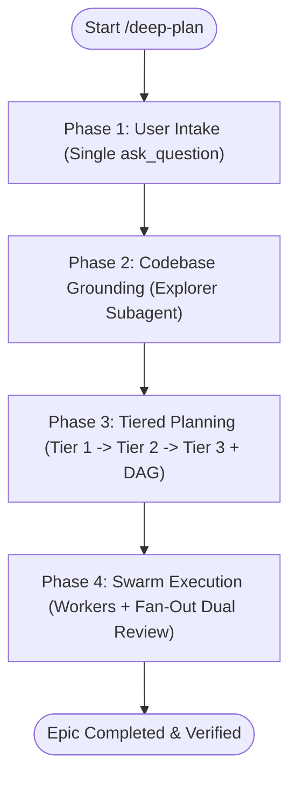

# Deep Plan

## Overview
Deep Plan orchestrates multi-agent software engineering swarms to plan and execute non-trivial code changes. It replaces monolithic planning docs and rigid conversational stops with a **3-tier document hierarchy** (Tier 1 Scope $\rightarrow$ Tier 2 Architecture Contracts $\rightarrow$ Tier 3 Atomic Task Cards) and an **Orchestrator-Worker-Reviewer swarm loop**.

---

## When to Use
- Changes spanning multiple modules or with complex dependency sequencing (>3 files).
- Database schema migrations, state mutations, or persistent invariant changes.
- Auth boundaries, permission updates, or security-sensitive workflows.
- High-uncertainty features requiring codebase grounding and adversarial stress-testing.

## When NOT to Use
- Single-file edits, trivial bug fixes, documentation, or styling tweaks. Implement directly.

---

## The Swarm Architecture

The Main Agent operates as the **PM / Orchestrator**. It does not write production code in the main context; it **dynamically assembles a team** of specialist subagents based on the epic type determined during Phase 1 intake.

### Core Agents (Always Active)

| Role | Responsibility | Reference |
| :--- | :--- | :--- |
| **PM / Orchestrator** | Coordinates DAG, manages state ledger, communicates with user | Main Thread |
| **Codebase Explorer** | Maps AST, schemas, dependencies, and blast radius | [codebase-explorer.md](references/subagents/codebase-explorer.md) |
| **System Architect** | Synthesizes Tier 1 into Tier 2 module specs and contracts | [system-architect.md](references/subagents/system-architect.md) |
| **Task Decomposer** | Slices Tier 2 modules into atomic Tier 3 tasks and DAG | [task-decomposer.md](references/subagents/task-decomposer.md) |
| **Worker Implementer** | Executes single Tier 3 task following TDD | [worker-implementer.md](references/subagents/worker-implementer.md) |
| **Spec Reviewer** | Verifies diff against acceptance criteria and file boundaries | [spec-reviewer.md](references/subagents/spec-reviewer.md) |
| **Adversarial Challenger** | Stress-tests implementation for silent invariant failures/bugs | [adversarial-challenger.md](references/subagents/adversarial-challenger.md) |

### Specialist Agents (Conditionally Activated)

| Role | Activated When | Reference |
| :--- | :--- | :--- |
| **Security Architect** | Epic touches auth, PII, trust boundaries | [security-architect.md](references/subagents/security-architect.md) |
| **Security Auditor** | Fan-out reviewer for security-tagged tasks | [security-auditor.md](references/subagents/security-auditor.md) |
| **Performance Engineer** | Specialized worker for perf-critical tasks | [performance-engineer.md](references/subagents/performance-engineer.md) |
| **Performance Benchmarker** | Fan-out reviewer validating NFR budgets | [performance-benchmarker.md](references/subagents/performance-benchmarker.md) |
| **Researcher** | Unresolved unknowns (`R{n}`) block a task | [researcher.md](references/subagents/researcher.md) |
| **Documentation Writer** | Epic adds public APIs or breaking changes | [documentation-writer.md](references/subagents/documentation-writer.md) |

**Full catalog & task-type routing rules:** [agent-catalog.md](references/agent-catalog.md)

---

## The 4-Phase Lifecycle

### Phase 1: User Intake (Single Interaction)
- **Protocol:** Read [intake-and-grounding.md](references/intake-and-grounding.md).
- **Intake Tool:** Trigger `ask_question` once upfront to determine:
  1. **Autonomy Mode:** `Autonomous` (PM decides implementation patterns, minimizes stops) vs. `Collaborative` (consults user on major forks).
  2. **Epic Nature:** New Feature, Refactor, Bug Fix, or Performance/Concurrency.

### Phase 2: Codebase Grounding & Context Mapping
- Dispatch **Codebase Explorer Subagent** to survey the repository without bloating the PM context.
- Explorer extracts schemas, coding conventions, test patterns, and blast radius.
- Produces the **Grounding Dossier**. Resolves critical unknowns via tool documentation or marks them as a research spike.

### Phase 3: Tiered Planning (Zero Ambiguity)
- **Protocol:** Read [tiered-planning.md](references/tiered-planning.md).
- Generates the 3-tier document structure under `.deep-plan/<epic-slug>/`:
  1. **Tier 1 (High-Level):** `00-tier1-epic.md` — Business problem, objective, invariants, and scope boundaries. Template: [tier1-epic-template.md](templates/tier1-epic-template.md).
  2. **Tier 2 (Mid-Level):** `modules/M{n}-<name>.md` — Dispatches **System Architect** to specify interface contracts, sequence flows, and schemas. Template: [tier2-module-template.md](templates/tier2-module-template.md).
  3. **Tier 3 (Low-Level):** `tasks/T{n}-<name>.md` — Dispatches **Task Decomposer** to create atomic execution cards. Each card specifies target files, line ranges, sad paths, and non-vacuous test commands. Template: [tier3-task-template.md](templates/tier3-task-template.md).
  4. **Execution DAG:** Outputs `dependency-dag.json` and initializes `progress-ledger.md` (Template: [progress-ledger-template.md](templates/progress-ledger-template.md)).
- If in *Collaborative Mode*, present Tier 1 summary for confirmation. In *Autonomous Mode*, transition immediately to Phase 4.

### Phase 4: Swarm Execution & Dual-Review Fan-Out
- **Protocol:** Read [swarm-execution.md](references/swarm-execution.md).
- **Dispatch Loop:**
  1. PM identifies unblocked tasks in `dependency-dag.json`.
  2. Dispatches **Worker Implementer** for each ready task (can parallelize independent tasks).
  3. Worker follows TDD (test first $\rightarrow$ verify fail $\rightarrow$ implement $\rightarrow$ verify pass $\rightarrow$ commit).
- **Dual-Review Fan-Out:** On task completion, PM immediately invokes **two subagents in parallel**:
  - **Spec Compliance Reviewer:** Verifies 100% contract adherence and zero scope creep.
  - **Adversarial Challenger:** Stress-tests invariants, concurrency, and sad paths.
- **Ledger Update:**
  - Both pass $\rightarrow$ Mark task `COMPLETED` in `progress-ledger.md` and unlock downstream DAG tasks.
  - Either fails $\rightarrow$ Dispatch remediation brief to worker $\rightarrow$ re-review.
- When all tasks complete, run global test suite and output final report.

---

## Anti-Patterns to Avoid
- **Context Pollution:** Never implement code in the PM/Orchestrator context. Always dispatch workers.
- **Ambiguous Grain:** Never leave tasks as vague bullet points. Every Tier 3 task must be a self-contained card with target files, line targets, and test commands.
- **Unverified Tests (Vacuous Tests):** Never accept tests that pass before code is written. Tests must fail against pre-fix code.
- **Hard Gate Fatigue:** Never pause execution for routine partial fits or minor design choices when in Autonomous mode.
