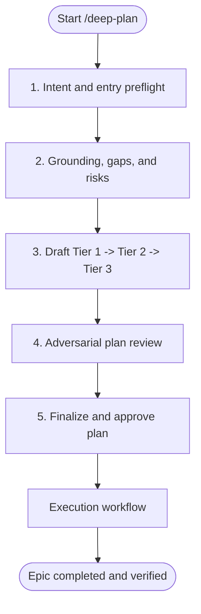

# Deep Plan

## Overview

Deep Plan guides complex engineering work through a persisted evidence trail and a five-phase planning lifecycle. Keep user intent, repository facts, risks, architecture, atomic tasks, dependencies, review evidence, and execution state linked. Use the main agent as PM / Orchestrator for planning, integration, and user communication; keep production implementation in worker contexts.

## When to Use

- Changes spanning multiple modules or with complex dependency sequencing.
- Database schema migrations, state mutations, or persistent invariant changes.
- Auth boundaries, permission updates, or security-sensitive workflows.
- High-uncertainty features requiring codebase grounding and adversarial stress-testing.

## When NOT to Use

- Single-file edits, trivial bug fixes, documentation, or styling tweaks. Run a lightweight preflight first; if the work remains simple, use the repository's direct workflow.

## Agent Roles

| Role | Responsibility | Reference |
| :--- | :--- | :--- |
| **PM / Orchestrator** | Coordinates artifacts, DAG, ledger, integration, and user interaction | Main thread |
| **Codebase Explorer** | Maps architecture, dependencies, conventions, and blast radius | [codebase-explorer.md](references/subagents/codebase-explorer.md) |
| **System Architect** | Defines Tier 2 boundaries, contracts, data flow, and schemas | [system-architect.md](references/subagents/system-architect.md) |
| **Task Decomposer** | Creates atomic Tier 3 cards and the dependency DAG | [task-decomposer.md](references/subagents/task-decomposer.md) |
| **Plan Challenger** | Challenges scope, assumptions, risks, dependencies, and verification before execution | [plan-challenger.md](references/subagents/plan-challenger.md) |
| **Worker Implementer** | Executes a ready Tier 3 task in an isolated worktree | [worker-implementer.md](references/subagents/worker-implementer.md) |
| **Code Auditor** | Runs Standards and Spec review axes for code changes | [spec-reviewer.md](references/subagents/spec-reviewer.md) |
| **Adversarial Challenger** | Stress-tests implementation invariants and sad paths | [adversarial-challenger.md](references/subagents/adversarial-challenger.md) |

Use Security Architect, Security Auditor, Performance Engineer, Performance Benchmarker, Researcher, and Documentation Writer when the risk-and-task routing matrix activates them.

## Five-Phase Planning Lifecycle

### Phase 1: Intent and Entry Preflight

- Read [intake-and-grounding.md](references/intake-and-grounding.md).
- Infer communication depth from the request; do not ask the user to classify themselves.
- Ask for autonomy mode and task type only when the request does not establish them.
- Build and persist an intent dossier containing goals, behaviors, invariants, outputs, constraints, assumptions, and unresolved decisions.
- Run a lightweight preflight before committing to the full workflow. If grounding later proves the request simple, present the direct-implementation versus full-plan choice and record the decision.

### Phase 2: Grounding, Gaps, and Risks

- Use repository-provided mapping tools first. If unavailable, dispatch the Codebase Explorer with a thorough file-and-line evidence mandate.
- Persist the Grounding Dossier with stack, architecture, conventions, affected modules, dependencies, and coverage gaps.
- Enumerate unknowns and create a risk register before architecture design.
- Resolve external-library unknowns through documentation research or record explicit research tasks.
- Finalize complexity after grounding using dependency breadth, uncertainty, change risk, verification cost, and coordination cost.

### Phase 3: Tiered Planning

- Read [tiered-planning.md](references/tiered-planning.md).
- Generate Tier 1 scope and invariants, Tier 2 architecture contracts, Tier 3 atomic tasks, `dependency-dag.json`, and `progress-ledger.md`.
- Link every tier to the intent dossier, grounding evidence, and relevant risks.
- Treat a task as atomic when it is one independently verifiable behavioral or contract change. File count is a heuristic, not a hard limit.

### Phase 4: Adversarial Plan Review

- Read [plan-review.md](references/plan-review.md).
- Dispatch the Plan Challenger against scope, assumptions, architecture, risks, dependency readiness, acceptance criteria, and verification feasibility.
- When a boundary-changing architecture fork is found, pause and use the question tool to synchronize the decision with the user. Present a recommendation and concrete tradeoffs.

### Phase 5: Finalize and Approve the Plan

- Validate artifact links, task IDs, dependency references, DAG acyclicity, and ledger initialization.
- In Collaborative Mode, require explicit user approval after the complete Tier 1, Tier 2, and Tier 3 plan.
- In Autonomous Mode, proceed after validation unless a boundary-changing architecture fork requires user synchronization.

## Execution Workflow

- Read [swarm-execution.md](references/swarm-execution.md).
- Dispatch only tasks whose artifact and contract dependencies are completed and integrated.
- Use per-task worktrees or branches. Parallelize conservatively only when target ownership and integration risk are acceptable.
- Select verification from the task-declared mode. Apply TDD to code tasks; follow repository conventions for documentation and other non-code tasks.
- For code changes, require Code Auditor and Adversarial Challenger review. Add security or performance reviewers from the risk-and-task matrix.
- Integrate approved commits into the parent branch, run verification on the integrated tree, and only then unlock dependents.
- Maintain the ledger state machine and bounded remediation policy. Resume from the ledger, DAG, plan artifacts, commit records, and handoff summary after quota exhaustion or session loss.
- Run Documentation Writer after implementation when public APIs, configuration, migrations, or breaking changes require documentation.

## Completion Evidence

Mark a task `COMPLETED` only after recording an evidence bundle containing the integrated commit, task verification, applicable quality checks, reviewer verdicts, invariant impact, and ledger update. Run repository-derived global verification after all tasks complete.

## Anti-Patterns to Avoid

- Do not implement production code in the PM context.
- Do not dispatch a task before every declared artifact and contract dependency is completed and integrated.
- Do not assume a failing or unfinished task will provide a future contract.
- Do not mark a task complete from reviewer PASS alone; integrate and verify the parent tree.
- Do not force red-green TDD onto documentation, configuration, migration, or benchmark tasks when another declared verification mode applies.
- Do not hide inferred invariants, architecture decisions, or risk acceptance; label assumptions and escalate boundary-changing forks.
