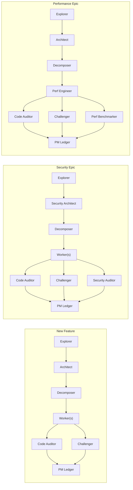

# Deep Plan: Agent Catalog & Task Routing

## Overview

The PM / Orchestrator does not use all agents on every epic. It **dynamically assembles a team** based on the task taxonomy determined during Phase 1 intake. This catalog defines available specialist roles and the routing rules for composing them.

---

## Agent Catalog

### Planning Agents (Phase 2–3)

| Agent | Role | When Activated | Reference |
| :--- | :--- | :--- | :--- |
| **Codebase Explorer** | Maps AST, schemas, dependencies, conventions, blast radius. Read-only. | Always (Phase 2) | [codebase-explorer.md](subagents/codebase-explorer.md) |
| **System Architect** | Designs Tier 2 module specs: component boundaries, interface contracts, sequence flows, schemas. | Always (Phase 3) | [system-architect.md](subagents/system-architect.md) |
| **Security Architect** | Designs auth flows, trust boundaries, threat models, permission schemas. Produces security-specific Tier 2 modules. | When epic touches auth, PII, trust boundaries, or external credential flows. | [security-architect.md](subagents/security-architect.md) |
| **Task Decomposer** | Slices Tier 2 modules into atomic Tier 3 tasks and generates `dependency-dag.json`. | Always (Phase 3) | [task-decomposer.md](subagents/task-decomposer.md) |
| **Plan Challenger** | Challenges scope, assumptions, risks, dependencies, and verification before execution. | Always before finalization | [plan-challenger.md](subagents/plan-challenger.md) |

### Execution Agents (Phase 4)

| Agent | Role | When Activated | Reference |
| :--- | :--- | :--- | :--- |
| **Worker Implementer** | Implements a single ready Tier 3 task using its declared verification mode. Commits clean, atomic changes. | Per ready task | [worker-implementer.md](subagents/worker-implementer.md) |
| **Performance Engineer** | Implements performance-critical tasks: caching layers, query optimization, concurrency primitives, benchmarking harnesses. | When task is tagged `perf` or epic type is `Performance / Concurrency`. | [performance-engineer.md](subagents/performance-engineer.md) |
| **Researcher** | Investigates external APIs, library behavior, version compatibility, or design patterns before implementation. Produces spike reports. | When unknowns exist in the Grounding Dossier or a task has an unresolved `R{n}` research item. | [researcher.md](subagents/researcher.md) |

### Verification Agents (Phase 4, Fan-Out)

| Agent | Role | When Activated | Reference |
| :--- | :--- | :--- | :--- |
| **Code Auditor** | Runs separate Standards and Spec review axes for code changes. Detects omissions, scope creep, and standards violations. | Mandatory for code changes | [spec-reviewer.md](subagents/spec-reviewer.md) |
| **Adversarial Challenger** | Stress-tests implementation for invariant violations, race conditions, silent failures, edge cases. | Always (Phase 4, per task completion) | [adversarial-challenger.md](subagents/adversarial-challenger.md) |
| **Security Auditor** | Reviews code for injection vectors, auth bypass, secret leakage, OWASP Top 10. Runs static analysis checks. | When epic touches auth, PII, trust boundaries, or any task mitigates a security risk (`S{n}`). | [security-auditor.md](subagents/security-auditor.md) |
| **Performance Benchmarker** | Validates performance tasks meet latency/throughput budgets. Runs benchmarks pre and post implementation. | When epic type is `Performance / Concurrency` or task is tagged `perf`. | [performance-benchmarker.md](subagents/performance-benchmarker.md) |

### Post-Execution Agents (Phase 4 Completion)

| Agent | Role | When Activated | Reference |
| :--- | :--- | :--- | :--- |
| **Documentation Writer** | Generates or updates API docs, README sections, migration guides, and changelog entries from completed Tier 2/3 specs. | When epic adds new public APIs, config options, or breaking changes. | [documentation-writer.md](subagents/documentation-writer.md) |

---

## Task-Type Routing Table

The PM consults this table after Phase 1 intake to determine which agents to activate for the epic. Agents marked **Core** are always present; agents marked **Specialist** are conditionally activated.

| Epic Type | Planning Team | Execution Workers | Verification Fan-Out | Post-Execution |
| :--- | :--- | :--- | :--- | :--- |
| **New Feature** | Explorer, Architect, Decomposer | Worker Implementer | Code Auditor, Challenger | Documentation Writer (if public API) |
| **Refactoring** | Explorer, Architect, Decomposer | Worker Implementer | Code Auditor, Challenger | — |
| **Bug Fix** | Explorer, Researcher, Decomposer | Worker Implementer | Code Auditor, Challenger | — |
| **Performance** | Explorer, Architect, Decomposer | **Performance Engineer** | Code Auditor, Challenger, **Performance Benchmarker** | — |
| **Security** | Explorer, **Security Architect**, Decomposer | Worker Implementer | Code Auditor, Challenger, **Security Auditor** | Documentation Writer (if auth flow changed) |
| **Docs / Migration** | Explorer, Decomposer | **Documentation Writer** | Documentation validation | — |

### Routing Rules
1. Explorer, Architect, and Decomposer are planning roles. Code Auditor and Adversarial Challenger are mandatory for code changes. Do not invoke a role merely because its definition is installed.
2. Specialist agents are activated when the intake response, Grounding Dossier, risk register, or task metadata indicates their domain is relevant.
3. **Fan-out width is variable:** A security epic fans out 3 reviewers in parallel (Spec + Challenger + Security Auditor); a simple refactor fans out 2 (Spec + Challenger).
4. Researcher is activated on-demand whenever an unresolved research item blocks a task rather than letting the Worker guess.

---

## Agent Topology by Epic Type

