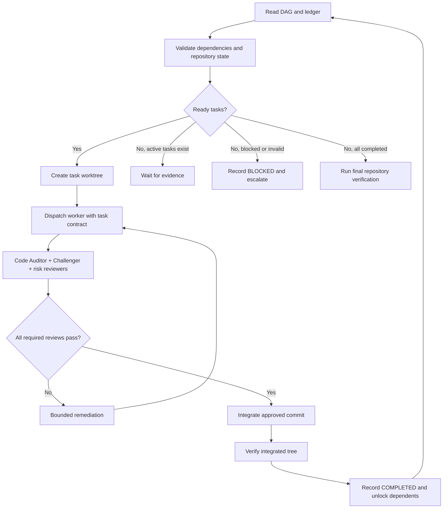

# Reference: Swarm Execution and Integration

Execute only after the five planning phases pass their gates.

## Execution Loop



## Task Selection and Dependencies

1. Read `dependency-dag.json` and `progress-ledger.md`.
2. Validate task IDs, dependency IDs, cycles, current branch, and repository cleanliness for the selected worktree.
3. Mark a task `READY_TO_DISPATCH` only when every artifact and contract dependency is `COMPLETED` and integrated.
4. Never assume unfinished work will provide a future contract.
5. Parallelize only when dependencies are complete, target ownership is disjoint, and integration risk is explicitly acceptable. Serialize otherwise.

## Worker Isolation and Dispatch

Create a per-task worktree or branch. Pass the worker:

- Tier 3 task path.
- Parent Tier 2 module path.
- Intent, grounding, and relevant risk paths.
- Parent branch and integration target.
- Verification mode and exact commands.
- Scope and permission boundaries.

The worker returns a commit SHA, modified paths, verification evidence, and observations. Keep task-specific context in the dynamic user prompt; do not mutate the installed role definition.

## Verification Modes

Apply the task-declared mode:

- `behavioral-tdd`: write a meaningful failing test, implement, pass, and run quality checks.
- `migration`: verify pre/post schema behavior, rollback or compatibility requirements, and migration-specific tests.
- `static-config`: validate syntax, schema, generated output, and repository checks.
- `documentation`: follow repository documentation conventions and validate links, examples, formatting, or documentation tests.
- `benchmark`: capture a reproducible baseline and post-change measurement against the declared budget.
- `repository-specific`: follow the documented command and expected evidence.

## Review Composition

For code changes, require Code Auditor and Adversarial Challenger. The Code Auditor runs two separate parallel axes: Standards and Spec. Add Security Auditor, Performance Benchmarker, or Documentation review when the risk-and-task matrix activates them.

Review the exact worker commit and record findings against paths and symbols. A PASS is not completion; it authorizes integration only when all required review axes pass.

## Remediation and Integration

1. If a required review fails, record the finding and increment the remediation count.
2. Dispatch a focused remediation task in the same isolated worktree or a new one.
3. Stop after the configured remediation limit and mark the task `BLOCKED` or `FAILED` with escalation evidence.
4. After all required reviews pass, integrate the approved commit into the parent branch through the explicit merge or cherry-pick seam.
5. Run affected verification on the integrated tree.
6. Record the integrated commit, verification, reviewer verdicts, invariant impact, and ledger transition before unlocking dependents.

## Ledger State Machine

Use these transitions:

```text
READY_TO_DISPATCH -> IN_PROGRESS -> IN_REVIEW -> INTEGRATING -> VERIFIED -> COMPLETED
IN_REVIEW -> IN_REMEDIATION -> IN_REVIEW
IN_PROGRESS -> BLOCKED | FAILED
IN_REVIEW -> BLOCKED | FAILED
```

Use `CANCELLED` when the user stops the epic. Detect and record deadlocks, invalid DAGs, unavailable required capabilities, and quota exhaustion rather than treating them as completion.

## Pause and Resume Protocol

The automation CLI is executed as `python "<skill-dir>/script/deep_plan.py"` from the target project root (where `<skill-dir>` is the directory where this `deep-plan` skill is installed).

### Intentional Pause

When the user or orchestrator stops the swarm (quota exhaustion, fatigue, end-of-day, blocker):
1. **Coordinate with Workers:** Signal running workers to halt and return their in-flight progress (`[Step X/Y Completed: ...]`).
2. **Commit In-Flight Worktree Changes:** Ensure workers commit any uncommitted changes to their task branches as a WIP commit (`git commit -m "wip(T{n}): step X/Y - <summary>"`). The CLI snapshots the parent repository checkout only; dirty worktree changes must be committed before pause to prevent data loss.
3. **Execute CLI Pause:** Run the `pause` command with repeatable `--task-progress` flags for each in-flight task:

```bash
python "<skill-dir>/script/deep_plan.py" pause <epic-slug> \
  --reason <reason> \
  [--note "<context note>"] \
  [--task-progress <task-id>:<completed-step>:<total-steps> ...]
```

This records declared step-level progress for in-flight tasks, creates a timestamped handoff dossier in `handoff/`, populates the ledger's Resume Checkpoint section, and persists git and task snapshots.

### Resume and Reconciliation

When a session starts or resumes:
```bash
python "<skill-dir>/script/deep_plan.py" resume <epic-slug>
```
The command verifies repository and branch integrity against the recorded checkpoint, inspects in-flight worktrees for unreviewed commits, reports pending reviews, lists ready-to-dispatch tasks, and prints an actionable briefing. For crash recovery where no prior `pause` occurred, `resume` still reconciles on-disk worktree state and ready tasks. Validate the current repository and integrated branch before dispatching new work.

## Final Epic Verification

When all tasks are `COMPLETED`, run only repository-derived applicable checks. Verify Tier 1 invariants, NFRs, documentation requirements, and the integrated branch. Report unavailable tooling separately from failed verification.

## Nested Delegation

Nested delegation is capability, not default orchestration. Keep workers, Code Auditors, and Adversarial Challengers non-nesting. Permit child delegation only for approved planning or research roles, at the configured maximum depth. Record all nested work in the parent task evidence; a child cannot complete a DAG task independently.
