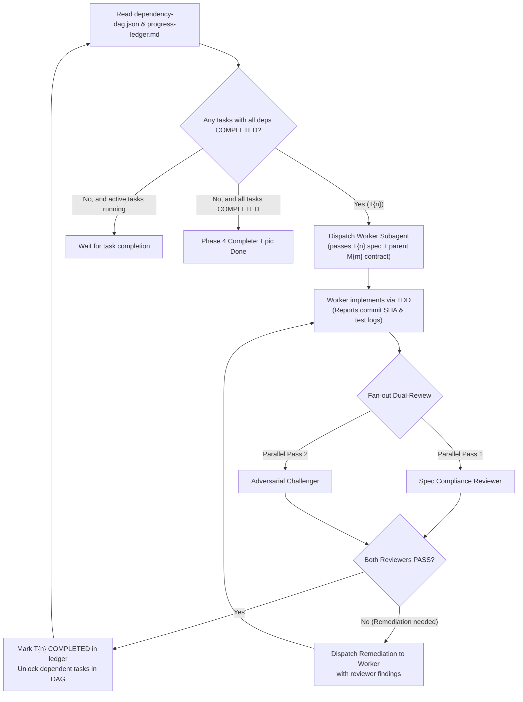

# Reference: Swarm Execution & Dual-Review (Phase 4)

## Overview
Phase 4 handles the dispatch and automated verification of Tier 3 tasks. The PM / Orchestrator coordinates worker implementers and reviewers against the `dependency-dag.json`.

---

## 1. The Orchestrator Execution Loop

---

## 2. Step 4.1: Task Selection & Concurrency
1. The PM inspects `dependency-dag.json` and `progress-ledger.md`.
2. Any task whose dependencies are all marked `COMPLETED` has status `READY_TO_DISPATCH`.
3. **Independent Parallel Dispatch:** If multiple tasks are `READY_TO_DISPATCH` and do not share target files, the PM can dispatch them concurrently to separate Worker Implementer subagents.

---

## 3. Step 4.2: Worker Dispatch
The PM invokes a Worker Implementer subagent (`references/subagents/worker-implementer.md`) with:
- Task Spec: `.deep-plan/<epic>/tasks/T{n}-[name].md`
- Module Spec: `.deep-plan/<epic>/modules/M{m}-[name].md`
- Working directory / git branch.

The Worker:
1. Writes test first (verifies it fails).
2. Writes code to pass test.
3. Commits changes cleanly (`feat(M{m}): implement T{n}`).
4. Returns status, commit SHA, and test output.

---

## 4. Step 4.3: Fan-Out Dual-Review on Task Completion
Immediately upon receiving the Worker's completion report, the PM invokes **two subagents in parallel**:

### Reviewer 1: Spec Compliance Reviewer
- Spec: `references/subagents/spec-reviewer.md`
- Evaluates: Did the worker implement all requested criteria? Did the worker touch any out-of-scope files?

### Reviewer 2: Adversarial Challenger
- Spec: `references/subagents/adversarial-challenger.md`
- Evaluates: Are system invariants preserved? Are edge cases and sad paths properly handled? Did the worker introduce security risks or silent failures?

---

## 5. Step 4.4: Verdict Handling & Remediation Loop
- **If both review passes return PASS:**
  - PM updates `progress-ledger.md` marking task as `COMPLETED`.
  - Records commit SHA and review notes in the ledger.
  - Re-evaluates DAG to unlock newly unblocked tasks.
- **If either review pass returns FAIL:**
  - PM extracts the specific findings and actionable remediation from the failing verdict.
  - Dispatches a remediation task back to the Worker (or a dedicated Fix subagent).
  - Once fixed, re-runs the dual review. Never mark a task `COMPLETED` with an unaddressed critical finding.

---

## 6. Step 4.5: Final Epic Verification
When all tasks in `dependency-dag.json` are marked `COMPLETED`:
1. Run full test suite across the repository (`npm test`, `pytest`, `cargo test`).
2. Verify all system invariants from `00-tier1-epic.md` are green.
3. Output final completion summary to user.
