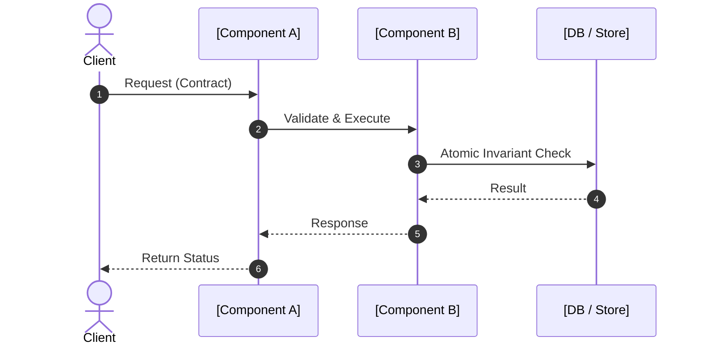

# Tier 2: Module Specification — M{n}: [Module Name]

> **Architecture & Contract Specification**
> Defines component boundaries, interface contracts, state changes, and child tasks.
> Written by System Architect Subagent during Phase 3.

---

## 1. Module Responsibility & Boundaries
- **Parent Epic:** `00-tier1-epic.md`
- **Module ID:** M{n}
- **Primary Responsibility:** [Single, clear summary of what this component owns]
- **Blast Radius / Impacted Files:** [Directories and core files touched]
- **Downstream Consumers:** [Other modules or external clients consuming this module]
- **Owned State / Data:** [State, records, resources, or `None`; identify the authoritative owner]
- **Inputs and Upstream Contracts:** [Named producers and contracts this module consumes]
- **Design Status:** [Repository fact | proposed design | assumption; cite grounding evidence or decision ID]

---

## 2. Interface Contracts & Schemas

### Contract Semantics
- **Preconditions and validation owner:** [What must be true; where validation occurs]
- **Success result and postconditions:** [Observable result and state guarantees]
- **Failure results and retry / fallback policy:** [Structured errors, retryability, state after failure]
- **Compatibility, migration, and rollback:** [Versioning, rollout, or `N/A` with reason]
- **Observability:** [Logs, metrics, audit events, or `N/A` with reason]

### API / Function Signatures
```typescript
// Define exact interface, types, request/response structures
```

### Database & State Schema Modifications
```sql
-- Migration diff or state shape definition
```

---

## 3. Interaction Sequence & Data Flow


---

## 4. Module-Level Sad Paths & Error Contracts
| Scenario | Error Code / Trigger | System Response & Fallback | Invariant Guard |
| :--- | :--- | :--- | :--- |
| **SP-1** | [e.g. Network timeout] | [e.g. Retry with exponential backoff] | [e.g. Idempotency preserved] |
| **SP-2** | [e.g. Invalid payload / schema mismatch] | [e.g. Fast fail 400 with structured validation error] | [e.g. State unmodified] |

---

## 5. Invariant, NFR, and Risk Coverage
| Trace | Enforcement Mechanism | Failure Behavior | Verification-Relevant Evidence |
| :--- | :--- | :--- | :--- |
| `INV-x` / `NFR-x` / `RISK-x` | [Module mechanism] | [How the system preserves the guarantee] | [Task, test, migration, or review evidence] |

---

## 6. Child Tasks (Tier 3 Task Manifest)
*The Task Decomposer owns this manifest and updates it from the canonical task cards and DAG. The System Architect may list likely implementation seams, but must not assign task IDs or dependencies.*

| Task ID | Task Name | Dependencies | Complexity | Assigned Spec |
| :--- | :--- | :--- | :--- | :--- |
| **T01** | [Atomic task summary] | None | Low | `tasks/T01-[name].md` |
| **T02** | [Atomic task summary] | T01 | Mid | `tasks/T02-[name].md` |
| **T03** | [Atomic task summary] | T01, T02 | Low | `tasks/T03-[name].md` |
